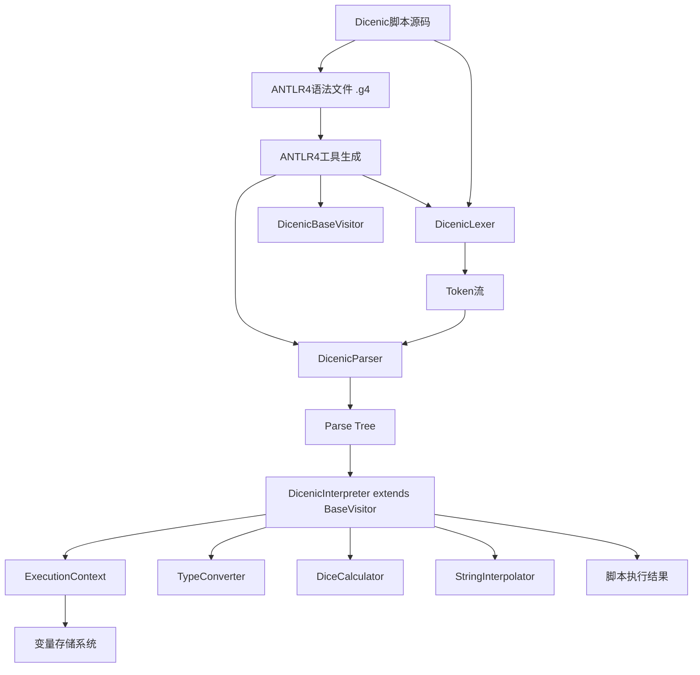
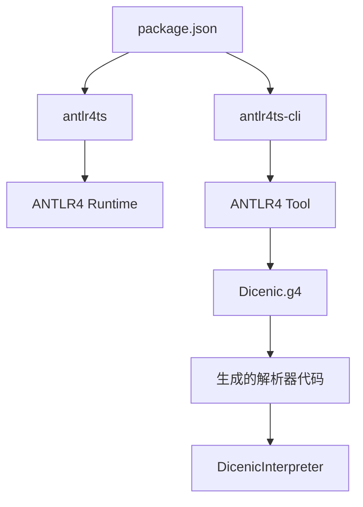

# 设计文档

## 概述

Dicenic脚本语言解析器是一个完整的解释器系统，专为游戏应用设计，支持安全的自定义脚本执行，具有特殊的变量系统和游戏相关功能。

考虑到解析器的复杂性和稳定性要求，我们将采用成熟的第三方库来构建核心解析功能，而不是从零开始实现。这种方案可以大大提高开发效率，减少bug，并获得更好的性能。

## 架构

### 技术选型

我们将使用以下成熟的开源库来构建Dicenic解析器：

1. **ANTLR4** - 用于语法定义和解析器生成
   - 强大的语法定义能力（.g4文件）
   - 自动生成词法分析器和语法分析器
   - 优秀的错误处理和恢复机制
   - 支持访问者模式和监听器模式

2. **antlr4ts** - ANTLR4的TypeScript运行时
   - 完整的TypeScript支持
   - 与ANTLR4工具链完美集成
   - 活跃的社区维护

### 整体架构图



### 分层架构

1. **语法定义层**
   - Dicenic.g4：ANTLR4语法文件
   - 定义完整的Dicenic语言语法规则
   - 包含词法规则和语法规则

2. **生成代码层**（ANTLR4自动生成）
   - DicenicLexer：词法分析器
   - DicenicParser：语法分析器
   - DicenicBaseVisitor：访问者基类
   - 相关类型定义和接口

3. **解释执行层**
   - DicenicInterpreter：继承BaseVisitor，实现具体执行逻辑
   - ExecutionContext：管理变量和作用域
   - 类型系统和转换

4. **工具层**
   - TypeConverter：处理类型转换
   - DiceCalculator：处理掷骰表达式
   - StringInterpolator：处理字符串插值

## 组件和接口

### 1. ANTLR4语法文件（Dicenic.g4）

```antlr
grammar Dicenic;

// 语法规则
program: statement* EOF;

statement
    : ifStatement
    | whileStatement
    | expressionStatement
    | block
    ;

ifStatement: 'if' '(' expression ')' statement ('else' statement)?;
whileStatement: 'while' '(' expression ')' statement;
expressionStatement: expression;
block: '{' statement* '}';

expression
    : ternaryExpression
    ;

ternaryExpression
    : logicalOrExpression ('?' expression ':' expression)?
    ;

logicalOrExpression
    : logicalAndExpression ('||' logicalAndExpression)*
    ;

// ... 其他表达式规则

// 词法规则
NUMBER: [0-9]+ ('.' [0-9]+)?;
DICE: [0-9]+ [dD] [0-9]+;
STRING: '"' (~["\r\n] | '\\' .)* '"' | '\'' (~['\r\n] | '\\' .)* '\'';
SPECIAL_VAR: '$' [arsd] [a-zA-Z_\u4e00-\u9fa5][a-zA-Z0-9_\u4e00-\u9fa5]*;
IDENTIFIER: [a-zA-Z_\u4e00-\u9fa5][a-zA-Z0-9_\u4e00-\u9fa5]*;

// ... 其他词法规则
```

**职责：**
- 定义完整的Dicenic语言语法
- 自动生成高效的解析器
- 提供优秀的错误处理机制

### 2. DicenicInterpreter（执行引擎）

```typescript
class DicenicInterpreter extends DicenicBaseVisitor<DicenicValue> {
  private context: ExecutionContext;
  private typeConverter: TypeConverter;
  private diceCalculator: DiceCalculator;
  private stringInterpolator: StringInterpolator;
  private lastValue: DicenicValue;
  
  constructor(context: ExecutionContext);
  interpret(script: string): string;
  
  // ANTLR4访问者方法（自动生成的方法签名）
  visitProgram(ctx: ProgramContext): DicenicValue;
  visitBinaryExpression(ctx: BinaryExpressionContext): DicenicValue;
  visitUnaryExpression(ctx: UnaryExpressionContext): DicenicValue;
  visitTernaryExpression(ctx: TernaryExpressionContext): DicenicValue;
  visitAssignmentExpression(ctx: AssignmentExpressionContext): DicenicValue;
  visitIfStatement(ctx: IfStatementContext): DicenicValue;
  visitWhileStatement(ctx: WhileStatementContext): DicenicValue;
  visitSpecialVariable(ctx: SpecialVariableContext): DicenicValue;
  visitDiceExpression(ctx: DiceExpressionContext): DicenicValue;
  visitStringLiteral(ctx: StringLiteralContext): DicenicValue;
  visitNumberLiteral(ctx: NumberLiteralContext): DicenicValue;
}
```

**职责：**
- 继承ANTLR4生成的BaseVisitor
- 实现各种语法节点的访问逻辑
- 管理变量赋值和读取
- 处理流程控制逻辑
- 返回最后表达式的字符串结果

### 3. ExecutionContext（执行上下文）

```typescript
class ExecutionContext {
  private attributes: Map<string, DicenicValue>;
  private roleInfo: Map<string, DicenicValue>;
  private systemInfo: Map<string, DicenicValue>;
  private diceInfo: Map<string, DicenicValue>;
  private variables: Map<string, DicenicValue>;
  
  constructor(initialContext?: Partial<ExecutionContextData>);
  
  // 变量操作方法
  getVariable(name: string): DicenicValue;
  setVariable(name: string, value: DicenicValue): void;
  getSpecialVariable(prefix: string, name: string): DicenicValue;
  setSpecialVariable(prefix: string, name: string, value: DicenicValue): void;
  
  // 权限检查
  canWriteSpecialVariable(prefix: string): boolean;
}
```

**职责：**
- 管理所有类型的变量存储
- 提供变量访问权限控制
- 处理特殊变量的默认值逻辑

### 4. TypeConverter（类型转换器）

```typescript
class TypeConverter {
  static toNumber(value: DicenicValue): number;
  static toString(value: DicenicValue): string;
  static toBoolean(value: DicenicValue): boolean;
  static toDicenicValue(value: any, targetType?: VariableType): DicenicValue;
  
  // 隐式转换
  static implicitConvert(value: DicenicValue, targetType: VariableType): DicenicValue;
  
  // 运算时的类型转换
  static convertForOperation(left: DicenicValue, right: DicenicValue, operator: TokenType): [DicenicValue, DicenicValue];
}
```

**职责：**
- 处理所有类型转换逻辑
- 实现隐式类型转换规则
- 提供运算时的类型协调

### 5. DiceCalculator（掷骰计算器）

```typescript
class DiceCalculator {
  static calculate(count: number, sides: number): number;
  static parseDiceExpression(expression: string): { count: number, sides: number };
  static validateDiceExpression(count: number, sides: number): boolean;
}
```

**职责：**
- 解析掷骰表达式
- 执行掷骰计算
- 验证掷骰参数有效性

### 6. StringInterpolator（字符串插值处理器）

```typescript
class StringInterpolator {
  static interpolate(template: string, context: ExecutionContext): string;
  private static parseInterpolationExpressions(template: string): InterpolationExpression[];
  private static evaluateExpression(expression: string, context: ExecutionContext): string;
}
```

**职责：**
- 处理字符串中的变量插值
- 支持 `{$variable}` 语法
- 递归处理嵌套表达式

## 数据模型

### 变量类型系统

```typescript
enum VariableType {
  NUMBER = 'NUMBER',
  STRING = 'STRING',
  DICE_EXPRESSION = 'DICE_EXPRESSION'
}

interface DicenicValue {
  type: VariableType;
  value: number | string;
}
```

### 特殊变量前缀映射

```typescript
enum SpecialVariablePrefix {
  ATTRIBUTE = 'a',    // $a - 角色卡属性（可读写）
  ROLE = 'r',         // $r - 角色信息（只读）
  SYSTEM = 's',       // $s - 系统信息（只读）
  DICE = 'd'          // $d - 骰娘信息（可读写）
}
```

### ANTLR4生成的Parse Tree结构

ANTLR4会自动生成Parse Tree节点类型，我们不需要手动定义AST节点。主要的Context类型包括：

```typescript
// ANTLR4自动生成的Context类型
class ProgramContext extends ParserRuleContext
class StatementContext extends ParserRuleContext
class ExpressionContext extends ParserRuleContext
class BinaryExpressionContext extends ParserRuleContext
class IfStatementContext extends ParserRuleContext
class WhileStatementContext extends ParserRuleContext
// ... 其他Context类型
```

### 项目依赖结构



## 错误处理

### 错误类型定义

```typescript
class DicenicError extends Error {
  constructor(message: string, line: number, column: number);
}

class SyntaxError extends DicenicError {}
class RuntimeError extends DicenicError {}
class TypeConversionError extends DicenicError {}
class VariableAccessError extends DicenicError {}
```

### 错误处理策略

1. **词法错误**：立即抛出，包含位置信息
2. **语法错误**：尝试错误恢复，继续解析
3. **运行时错误**：提供详细上下文信息
4. **类型转换错误**：使用默认值并记录警告

## 测试策略

### 单元测试覆盖

1. **语法文件测试**
   - ANTLR4语法规则的正确性
   - 各种语法结构的解析
   - 运算符优先级验证

2. **Interpreter测试**
   - 表达式求值
   - 变量操作
   - 流程控制
   - 类型转换

3. **工具类测试**
   - TypeConverter各种转换场景
   - DiceCalculator掷骰逻辑
   - StringInterpolator插值处理

4. **集成测试**
   - 完整脚本执行
   - 复杂场景测试
   - 性能测试

### 测试用例示例

```typescript
describe('Dicenic Interpreter', () => {
  let interpreter: DicenicInterpreter;
  let context: ExecutionContext;

  beforeEach(() => {
    context = new ExecutionContext();
    interpreter = new DicenicInterpreter(context);
  });

  test('解析基本算术表达式', () => {
    const script = '1 + 2 * 3';
    const result = interpreter.interpret(script);
    expect(result).toBe('7');
  });

  test('解析特殊变量', () => {
    context.setSpecialVariable('a', '力量', { type: VariableType.NUMBER, value: 15 });
    const script = '$a力量 + 10';
    const result = interpreter.interpret(script);
    expect(result).toBe('25');
  });

  test('解析掷骰表达式', () => {
    const script = '3d6';
    const result = interpreter.interpret(script);
    const numResult = parseInt(result);
    expect(numResult).toBeGreaterThanOrEqual(3);
    expect(numResult).toBeLessThanOrEqual(18);
  });

  test('解析if-else语句', () => {
    context.setSpecialVariable('a', 'SAN', { type: VariableType.NUMBER, value: 15 });
    const script = 'if ($aSAN < 20) { "疯狂边缘" } else { "理智正常" }';
    const result = interpreter.interpret(script);
    expect(result).toBe('疯狂边缘');
  });
});
```

## 性能考虑

### 优化策略

1. **Token缓存**：避免重复词法分析
2. **AST复用**：相同脚本的AST可以缓存
3. **变量查找优化**：使用Map提高查找效率
4. **类型转换缓存**：缓存常用转换结果

### 内存管理

1. **及时清理**：执行完成后清理临时变量
2. **循环检测**：防止无限循环导致内存泄漏
3. **深度限制**：限制递归调用深度

## 实现优势

### 使用ANTLR4的优势

1. **成熟稳定**：ANTLR4是业界标准的解析器生成工具，被广泛使用
2. **高性能**：生成的解析器经过优化，性能优秀
3. **错误处理**：内置优秀的错误恢复和报告机制
4. **语法清晰**：.g4文件提供清晰的语法定义，易于维护
5. **工具支持**：丰富的开发工具和IDE插件支持
6. **社区支持**：活跃的社区和丰富的文档资源

### 开发流程

1. **语法设计**：编写Dicenic.g4语法文件
2. **代码生成**：使用ANTLR4工具生成TypeScript解析器代码
3. **解释器实现**：继承BaseVisitor实现具体的执行逻辑
4. **工具类开发**：实现类型转换、掷骰计算等工具类
5. **测试验证**：编写全面的测试用例
6. **集成优化**：性能优化和错误处理完善

### 项目结构

```
src/
├── grammar/
│   └── Dicenic.g4              # ANTLR4语法文件
├── generated/                  # ANTLR4生成的代码
│   ├── DicenicLexer.ts
│   ├── DicenicParser.ts
│   └── DicenicBaseVisitor.ts
├── interpreter/
│   ├── DicenicInterpreter.ts   # 主解释器
│   ├── ExecutionContext.ts     # 执行上下文
│   └── types.ts               # 类型定义
├── utils/
│   ├── TypeConverter.ts        # 类型转换器
│   ├── DiceCalculator.ts       # 掷骰计算器
│   └── StringInterpolator.ts   # 字符串插值
├── errors/
│   └── DicenicError.ts        # 错误类定义
└── index.ts                   # 主入口文件
```

### 构建配置

需要在package.json中添加构建脚本：

```json
{
  "scripts": {
    "antlr4": "antlr4ts -visitor src/grammar/Dicenic.g4 -o src/generated",
    "prebuild": "npm run antlr4",
    "build": "tsc",
    "test": "jest"
  },
  "dependencies": {
    "antlr4ts": "^0.5.0-alpha.4"
  },
  "devDependencies": {
    "antlr4ts-cli": "^0.5.0-alpha.4"
  }
}
```